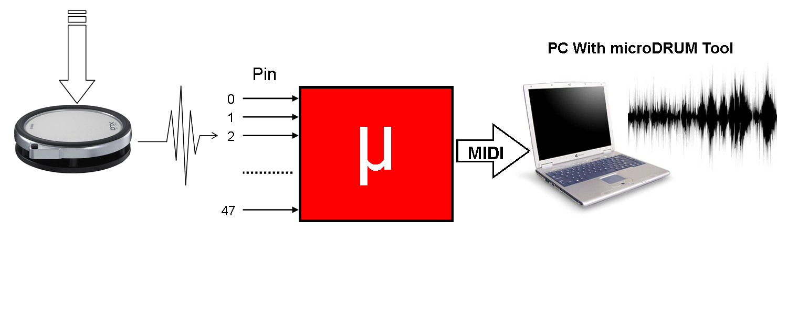
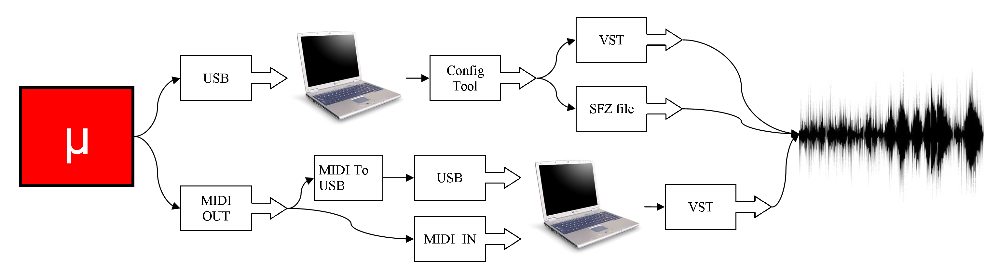

microDrum是MIDI触发控制器。鼓垫（或镲）产生的每一个脉冲，都由microDrum转换成一个MIDI音符，如图所示，

为了让PC接收MIDI音符，电脑必须有一个MIDI端口或一个USB-MIDI转换器。然后电脑将MIDI音符变成声音。
为了做到这一点，你需要一种称之为VST插件的特别软件，或者称之为“虚拟演播室技术插件”。如果你的电脑没有一个程序可以当做VST插件的宿主软件，你可以使用config-tool作为一个VST宿主。
如果你使用config-tool，你（的电脑）不需要MIDI口，只要一个USB口，如您所看到的这张图。当你没有VST时，通过配置工具config-tool，你也可以上传SFZ文件来使用。

隐藏在microDrum的想法是：提供一个人人都建得起的经济的“电子鼓”的方法，为此，microDrum的心脏是经济的Arduino。

## 主要特性

* 48 路触发器输入
* MIDI 输入/输出
* USB 端口 (允许对microDrum进行配置)
* 设置可定制，用以消除多触发、串扰等等...
* 支持开关或可变的带CC位置的HiHat控制器
  or dedicated notes on all zones for 6 levels of intermediate levels of the
  pedal positions.
* 设置保存在内部的EEPROM中
* 还有更多… 
