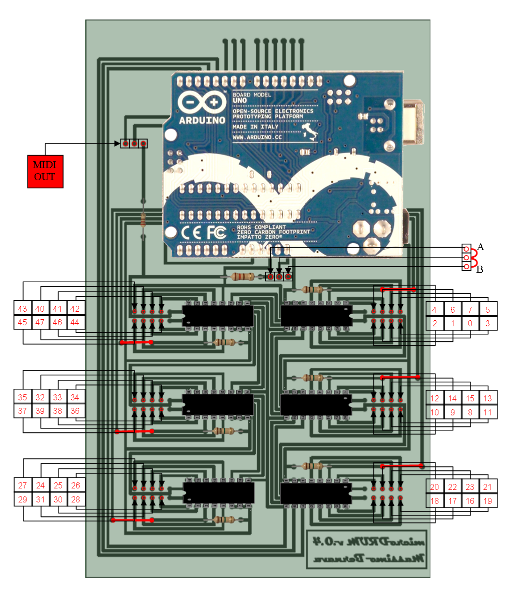

建筑的测微鼓轮很简单。您可以使用出售的“官方”PCB。
商店，自己创建一个或使用矩阵板。使用PDF文件
你可以打印
搭建microDrum非常简单，你可以使用商店里“官方”的PCB、自制、或者使用“洞洞板”，利用PDF文件，你在家里不需要大型昂贵的机械，就可打印和蚀刻电路板。

## 材料

* PCB (官方、自制、洞洞板）
* Arduino (UNO or Duemilanove，这是最核心的部件了)
* 8 个电阻  (1M 欧姆)
* 6 个集成电路插座 (16 脚)
* 6 个IC (型号：hc4851)
* 一些导线 

要把插座和microDrum连接起来，必须使用2x5线
 
可以通过以下几种方式进行：直接焊接电线，使用插脚等…

