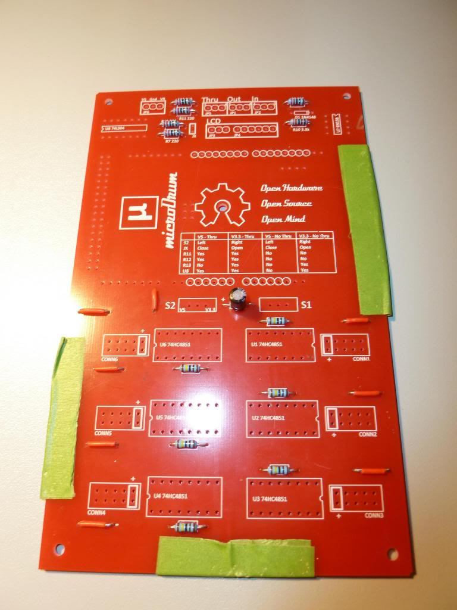
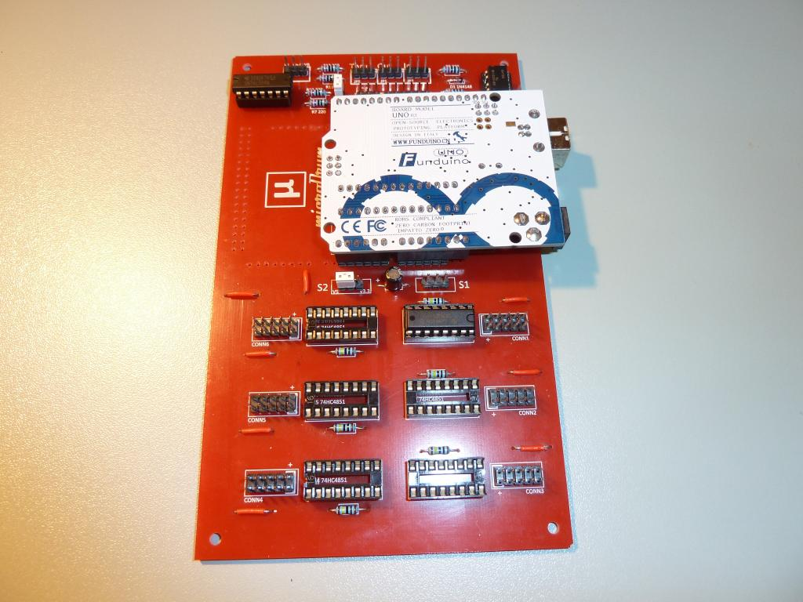

## Tools Required

使用官方的PCB来搭建microDrum是需要基本的焊接技术的，但这些都能很快就学会的，你要的只是一点实践。
有很多指南和视频可以告诉你怎么做。
您需要的工具如下所示：

| 工具                   | 描述 |
| ---------------------- | --- |
| 电烙铁         | 应该是25w和40W之间。尖端在2-3mm左右可能会更好点 |
| 烙铁架   | 非常有用, 避免让你的工作台成为烧伤痕迹累累的地方，可以用海棉来清洁 |
| 烙铁头的清洁  | 低磨料黄铜屑锅，用于清洁烙铁头。这不是必需的。 |
| 焊锡                 | If you buy a kit it may come with some leadfree solder. This flows a little less easily than lead solder, but is still okay for this build. Otherwise get some with a rosin core, also known as flux-core. 0.7mm diameter is a good size for this project, and soldering electronics in general. |
| Third Hand             | These are very useful! Basically a bar with a crocodile clip at each end and a magnifying glass in the middle, either you can use it to hold your board still and have solder in one of your hands and the iron in the other, or you can hold the solder with one clip, and bring the board to it whilst holding a part in place. A very cheap investment, not essential but worth it. The magnifying glass helps too. |
| 钢丝钳/剥线钳 | Useful for obvious reasons. You can get away with using cutters as strippers, if you are careful not to cut into the wire as well as the plastic sheath, or you can buy fancy strippers that make life easier |
| 尖嘴钳     | Not essential, but useful for bending wires, component leads, holding things in place etc... |
| 万用表            | These range from cheap to very expensive, and although not essential they are good for checking for short circuits and diagnosing issues. You can probably get away with being an optimist and not buying one until you finish building it. Then if you have problems get one and start checking those joints... |
| 绝缘胶带          | Definitely not essential, but stops the crocodile clips on a Helping Hand marking the edges of the pcb when holding it. |

## 主板 V0.7

填充PCB主板时可以使用几种选项，如下方所示。本指南照片中的主板已填写所有组件供参考，请随意省去不需要的部件。

| Part | V5 - Thru | V3.3 - Thru | V5 - No Thru | V3.3 - No Thru | 
| ---- | --------- | ----------- | ------------ | -------------- |
| S2   | Left      | Right       | Left         | Right          |
| JX   | Close     | Open        | Close        | Open           |
| R11  | Yes       | Yes         | No           | No             |
| R12  | Yes       | Yes         | No           | No             |
| R13  | No        | Yes         | No           | Yes            |
| U8   | Yes       | Yes         | No           | Yes            |

 

关于跳线和开关 - 可以根据照片进行填充，可根据实际来选择所需的选项，或者如果您从不期望更改位置，您可以简单地在所需位置焊接一根电线。

通过使用最小的配置文件填充pcb时，通常更容易，因此在进度中不会让您遇到困难。

### 裸板

以下是裸机主板V0.7 PCB的顶部和底部的照片，供参考：

### Example Kit

Here is a shot of the equipment used when building the board in this guide.
The glass jar is just there to collect cutoffs, it is sometimes useful to have a
short piece of wire available for shorting jumpers, and it stops them lying on
the floor ready to bite you...

### Step 1 - Wire Links

The pcb has a number of simple wire connections that need soldering in place on
the top, marked with white lines. This approach prevents the need to go with a
more expensive, 2-layer pcb that would bridge these joins on the top side.
Simply cut a piece of wire to length, push it through and solder.
Bending the legs outwards will help hold it in place whilst you solder.
Alternatively it is possible to hold the part in place on the top of the board,
and then bring the board to the solder, which could be held in a third hand.
Be warned, the component will potentially get hot as you hold it...

It is often helpful to check the position of the component after soldering the
first leg, in case it has slipped when you push the iron onto it.
If it has it is MUCH easier to readjust when only 1 joint needs reheating to
move it around.

You can check your soldering with a multimeter set to read resistance.
Put it in Ohms range, place one probe on the component lead to check, and the
other on a connection it should be connected to.
You should get a very low Ohm reading.
You can also ensure that you haven't accidentally connected it to surrounding
traces, or to ground, by the same method, but this time you should get a reading
that indicates infinite resistance (for example 0L).

When building the board in the photo I have used some red wire just so it blends
in nicely with the board, bare wire would be just as good. 

### Step 2 - Resistors

There are 13 resistors in total, but not all are necessarily required.

* **R1 - R6** - These are for the multiplex switches, and as such are only required
              if you intend to use that specific jack socket, i.e. if you only
              need 16 inputs (presuming 2 jack boards populated with stereo sockets),
              for instance, you only need to populate R1 & R2
              (and obviously U1 & U2, & CONN1 & CONN2...).

* **R8oC1** - If using a resistor rather than a capacitor here then you will need
            to install it! It is recommended that a capacitor (10 uF) is used
            if you are using an Arduino Uno.

* **R11 & R12** - If you intend to build your microDrum as a [MIDI-Thru](https://en.wikipedia.org/wiki/MIDI#Devices)
                version then you need to install R11 & R12, regardless of the
                type of Arduino board you intend to use.

* **R13** - This is only required if you are using a 3.3v Arduino Due.
          You can leave this out if you are using the Uno,
          a 5v (operating voltage) board.
          More info on the boards can be found [here](http://arduino.cc/en/Products.Compare).

### Step 3 - Capacitor

There is only 1 capacitor, which is an alternative for a resistor in the R8oC1
position, and is recommended if using the Uno.

The main thing to bear in mind is that this is an electrolytic capacitor, which
means it is polarised, which means you need to ensure you install it the right
way round, or it will not like it! The longest lead is the positive one, and
there is also normally a strip down the side of the cap by the negative lead,
with minus signs (looking like ovals) down it.

The +ve side is indicated on the mainboard, it is the left hole as you look at
the board with the bottom towards you. 

### Step 4 - Headers

There are a number of headers that need installing, and the parts list includes
the option of buying longer strips for splitting, which is generally a cheaper option...

Some of these headers are only needed if you plan on using certain options in
your build. Any you don't need can be left unpopulated.

* **JP1** - Required if you plan to use a MIDI Out connector on this board.
          The alternative is to use the USB connection on the Arduino board.

* **JP2** - Required for MIDI In connector.

* **JP3 & JP4** - Required if you are going to build the accompanying LCD screen.

* **JP5** - Required for the MIDI Thru build option.

* **JP6** - Required if you are going to build the accompanying LCD screen
          (used to supply power and ground connectivity).

* **JX** - Required if you are using a 5V Arduino board (Uno).

* **Arduino Connectors** - These need to go into the holes with the white circles around them.

* **S1** - A header can be used here instead of a switch, with a 2 pin jumper
         to select pins 1 & 2 (1 being the left most pin, nearest the R8oC1 postion)
         to close it, or 2 & 3 to connect the reset pin to ground.
         The reset pin should not be left floating (unconnected) as this may
         trigger random processor resets). A third (permanent) alternative would
         be to simply solder a clipped-off resistor lead between the required pin holes.

* **S2** - A header can be used here instead of a switch, with a 2 pin jumper to
         select pins 1 & 2 (1 being the left most pin, next to the 5V marking)
         if using a 5V Arduino board, or pins 2 & 3 if using a 3.3V board.

### Step 5 - Sockets

It is generally recommended that you use sockets for the IC chips, rather than
soldering them directly to the board. It makes it much easier to swap them out
if something should fail, for one thing...

Some of the sockets are optional depending on the build options you have chosen.

**U1 - U6** - The number of these used will depend on how many inputs you need for your triggers.

**U8** - Not required if you are not planning on using MIDI Thru and have a 5V Arduino board. 

### Step 6 - Connectors, ICs and Diode

Next install the connectors for the jack boards (CONN1 - CONN6).
Again, the number you install depends on how many jack boards you need to attach for your triggers.

It is advisable to only install one of the SN74HC4851 chips initially,
it helps with setup and any debugging.

IC chips often come with their legs splayed outwards.
Gently bend them to vertical on both sides against a flat surface, and be careful
to get all legs aligned before pushing them into place.

The Diode (D1) is polarised, so must be installed the correct way round.
The black band on the diode must line up with the white vertical stripe marking
in the component outline on the board, to the right. 

### Step 7 - Jumpers (5V Board)

Next install any jumpers required.
**Note - the photo does not show S1 jumper installed, it should be!**

### Step 8 - Arduino (or equivalent...)

The last stage is to carefully install your Arduino board, making sure the pins
all align before pushing it gently into place.

## Jackboard v0.4

There are a number of options when building the jackboard, depending on the type
of trigger to be connected. These are shown on the jackboard V0.4 schematic
available on the [download page](/en/downloads)

### Bare Board

Here are photos of the top and bottom of the bare Jackboard V0.4 PCB for
reference (showing 4 together with the Mainboard):

